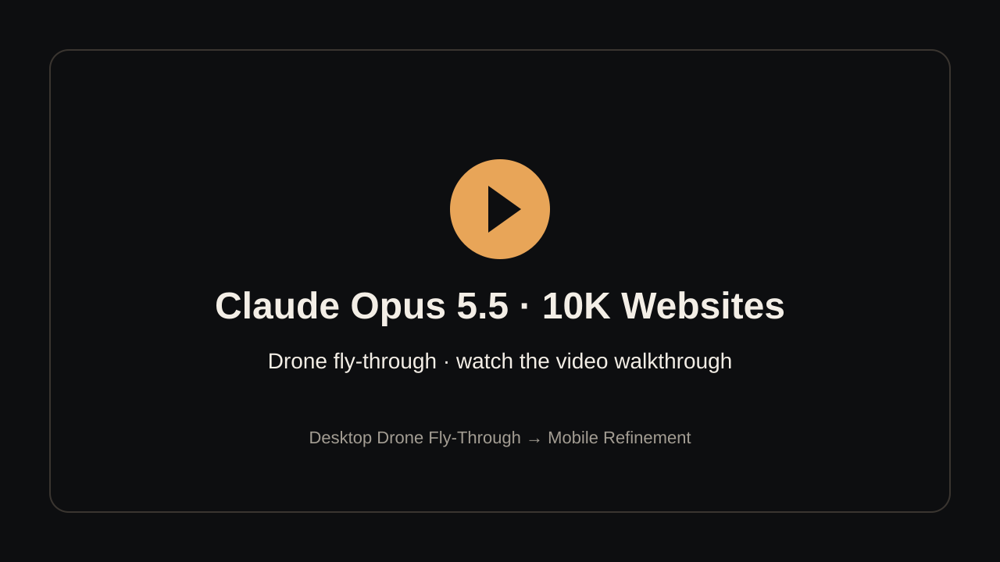

**[▶ Watch the full video walkthrough on YouTube](https://youtu.be/_PtVROzu3_w)**

# Claude Opus 5.5 · 10K Websites — Drone Fly-Through

Two reusable prompts for building a brand website around a **cinematic drone fly-through**, with Claude Opus 5.5 and Higgsfield MCP. One continuous first-person shot flies in the front door, weaves through the building like a real FPV pilot, flies out the back, spins round and climbs away to reveal the whole place. Scrolling drives the camera forwards and backwards.

Start with **Desktop Drone Fly-Through**, then use **Mobile Refinement** to create a tailored phone experience in the same website and codebase. Mobile reuses the desktop footage, so no extra video generation is needed.

## Start here

| Order | Prompt | What it does |
| --- | --- | --- |
| 1 | [Desktop Drone Fly-Through](prompts/01-desktop-drone-flythrough.md) | Builds the complete website: the business brief and brand direction, the flight path, the chained fly-through video, the scroll animation and the site content. |
| 2 | [Mobile Refinement](prompts/02-mobile-refinement.md) | Refines the same website for phones: persistent navigation with a glass-to-solid header, a centre-cropped reuse of the desktop footage, mobile scroll timing and single-column layouts. |

## What you need

- Claude Opus 5.5 in a coding environment that can create and run a website (for example Claude Code).
- **Higgsfield MCP connected, with image and video generation tools available.** The prompts use it for the start and reveal stills, the fly-through clips (image-to-video plus video extension), small video edits and stock imagery.
- **FFmpeg**, to check clips, stitch the master video and extract the scroll frames. If you don't have Homebrew, `npm install -g ffmpeg-static` works.
- Access to the generation models your workflow needs. Asset generation uses paid credits in your Higgsfield account. As a guide, one full desktop fly-through (three chained clips of about 12–15 seconds each, plus stills and small repairs) cost around 600–700 credits in testing. Extension jobs can cost more than the price check shows.
- A hosting option when you're ready to publish. The prompts follow whatever workflow your environment has.

**[Get started with Higgsfield — my referral link](https://higgsfield.ai/s/claude-opus-5-5-yt-bartslodyczka-UaAqBW)**

The prompts provide instructions. They don't install or connect Higgsfield MCP for you.

## 1. Build your website

Open [Desktop Drone Fly-Through](prompts/01-desktop-drone-flythrough.md), copy the entire prompt, and paste it into your website project conversation.

Share your business description and any existing company information, logo, colours, imagery or brand guidelines at the start. The prompt asks for anything important that's missing.

**Describe the route.** Tell it which spaces the camera should fly through and where it should come out, for example:

> Build a website for my car dealership. The drone flies in through the front doors, through the showroom, someone opens a door into the workshop, it keeps going through the parts warehouse and out the back roller door, then turns round and pulls up to show the whole dealership. I don't have a logo yet. Guide me through the brand direction and the flight path before you build.

If you don't know the route, describe the business and it will propose a realistic one for that type of premises.

Before generating any video, the prompt shows you a **Visual Story** table: each stretch of the flight, what the camera does, and the website copy that appears. It also gives a **Scroll pacing** plan. Say you want to work step by step to review these, or say "choose for me" / "build a template" to let it decide.

### How the fly-through is made

- **Real pilot moves, not a camera on rails.** Speed changes, banking, S-curves, turning to look along a product, realistic corners.
- **One chained take.** Clip A starts from an approved still. Clips B and C use the model's **video extension** mode to carry on from where the last clip ended, so the flight never cuts.
- **A physically correct ending.** Out the back door you only see what's actually outside. The camera spins 180° while moving, then flies backwards and climbs to reveal the building it just left, connected to its roads and surroundings.
- **Never say "drone" in a video prompt.** Models draw a drone flying through the shot. The prompt describes a first-person camera instead.
- **Repair, don't regenerate.** Stray objects are trimmed out or removed with a short video edit. Clips are stitched with hard cuts where they already match, and very short crossfades only where an edited piece meets an original one.

## 2. Refine the mobile experience

Once the desktop site is built, copy [Mobile Refinement](prompts/02-mobile-refinement.md) into **the same conversation and project**.

- **Glass-to-solid header.** See-through over the fly-through, so the footage flows behind it. It switches to a solid, blurred bar with a hairline border once you scroll past, and switches back when you scroll up.
- **Persistent mobile navigation.** The logo on the left and an accessible menu on the right, fixed the whole way down.
- **Reuses the desktop footage.** The fly-through is centre-cropped to fill a tall screen, with an optional per-scene shift if something important sits off-centre. There's no re-animation and no extra credits. Optionally, a pre-cropped portrait sequence can be cut from the same master to save bandwidth.
- **Mobile scroll timing and layouts.** Its own pacing, copy anchored to the bottom of the screen during the flight, and every section reflowed to a single column.

**Desktop and mobile stay one responsive website in one codebase.** The prompt also asks for desktop to be checked again after the changes.

## Before you launch

Review the business information, copy, links and primary action. Replace any sample content (stock, prices, reviews, opening hours) with real details. Never publish invented reviews for a real business. Check the actual desktop and phone experiences, and make sure any forms have a working destination. Publish when you're happy with the result.

"10K" describes the design ambition of the project. It isn't a claim of a completed sale or a guaranteed website valuation.
